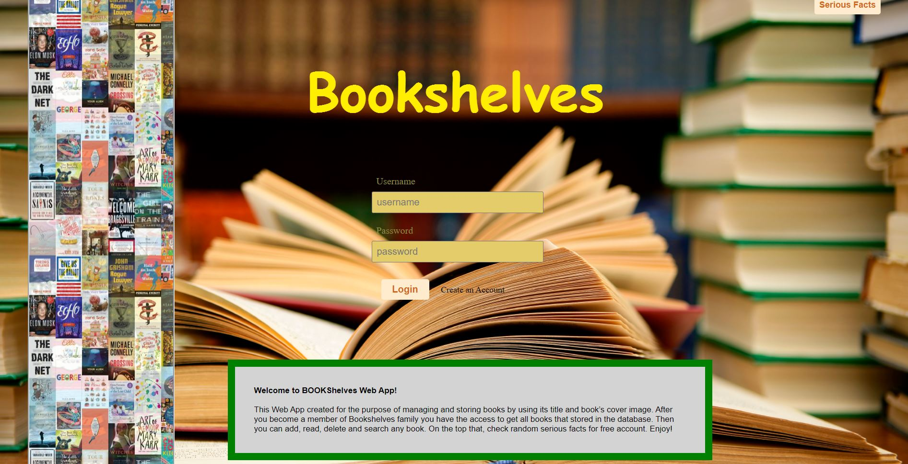

# BookShelves

BookShelves Web App created for the purpose of managing and storing books by using its title and book’s cover image. After you become a member of Bookshelves family you have the access to get all books that stored in the database. Then you can add, read, delete and search any book. On the top that, check random serious facts for free account.

# Technologies Used

- CSS
- HTML
- Java Script
- JSON

# How to locally run

The web app has not been deployed yet.

# Description for each pages

# Log-in Page

• Log-in and Sign-up pages
• Incorrect password and username gives a notice for the user
• Animation slides in front page to promote new books and other public announcement  
• Brief summary about the app
• Even if you don’t have account you have access to do something

# Home Page

• Add Books using book’s title and image URL
• Opening the file to get the file and read
• Delete Books

# Search Page

• Access the added book in the search bar
• Search Books using book’s title

# Fact Page

• Get random serious facts by clicking a button
• You have the access to see the facts even if you don’t have account
• Log Out: It takes you the log-in page

# Upcoming Features

• Creating List of Categories
• Reset Password
• Opening file from the cloud storage

# Author

Israel Getu is a Software Engineer in Devmountain, TX.
